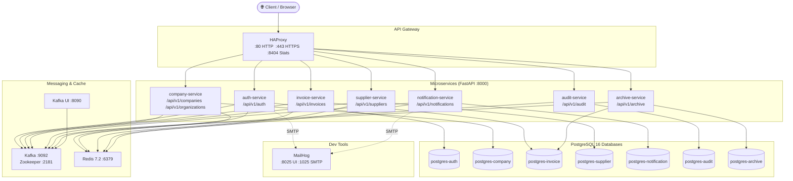
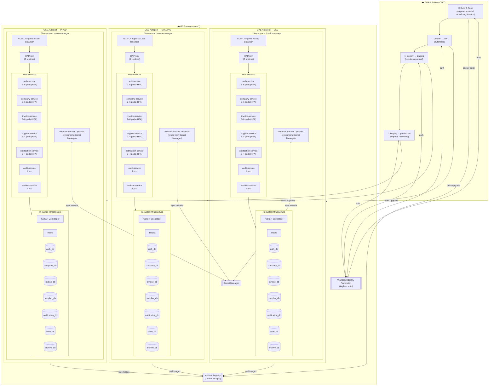

# InvoiceManager — Infrastructure Architecture

> Auto-generated on **2026-06-26 03:06 UTC** by [`scripts/generate_architecture_diagram.py`](../scripts/generate_architecture_diagram.py).
> Re-runs daily via GitHub Actions ([`.github/workflows/architecture-diagram.yml`](../.github/workflows/architecture-diagram.yml))
> and on every push that touches infrastructure files.

---

## Local Development Environment

Runs entirely via `docker-compose up`.
HAProxy listens on `:80`/`:443` and routes by URL path prefix to the relevant FastAPI microservice.

---

## GCP Cloud Architecture (dev / staging / production)

Three identical GKE Autopilot clusters — one per environment.
Images are built once and promoted through dev → staging → production.

---

## Key Components

| Component | Technology | Notes |
|-----------|-----------|-------|
| API Gateway | HAProxy 2.9 | Path-based routing, health checks, stats UI |
| Microservices | FastAPI (Python) | 7 services, each with its own PostgreSQL DB |
| Message bus | Apache Kafka 7.6 + Zookeeper | Event-driven communication between services |
| Cache / sessions | Redis 7.2 | Per-service DB index (0–4) |
| Container runtime | Docker / GKE Autopilot | Local: Docker Compose; Cloud: GKE Autopilot |
| Image registry | GCP Artifact Registry | `europe-west1` region |
| Secret management | GCP Secret Manager + External Secrets Operator | No secrets in code or CI env vars |
| Auth | Workload Identity Federation | Keyless GCP auth from GitHub Actions |
| IaC | Terraform 1.9+ (GCS remote state) | Modules: network, GKE, IAM, AR, Secret Manager, WIF |
| Helm chart | `k8s/helm/invoicemanager` | Single chart, per-env values files |
| CI/CD | GitHub Actions | build → dev → staging → prod (with approvals) |
| Autoscaling | HPA | Most services: 2–8 pods; audit/archive: 1–2 pods |

---

## Service → Route Mapping (HAProxy)

| Route prefix | Service |
|-------------|---------|
| `/api/v1/auth` | `auth-service` |
| `/api/v1/companies` | `company-service` |
| `/api/v1/organizations` | `company-service` |
| `/api/v1/invoices` | `invoice-service` |
| `/api/v1/suppliers` | `supplier-service` |
| `/api/v1/notifications` | `notification-service` |
| `/api/v1/audit` | `audit-service` |
| `/api/v1/archive` | `archive-service` |

---

## Terraform Modules (dev environment)

- `apis`
- `network`
- `gke`
- `artifact_registry`
- `iam`
- `secrets`
- `workload_identity`
